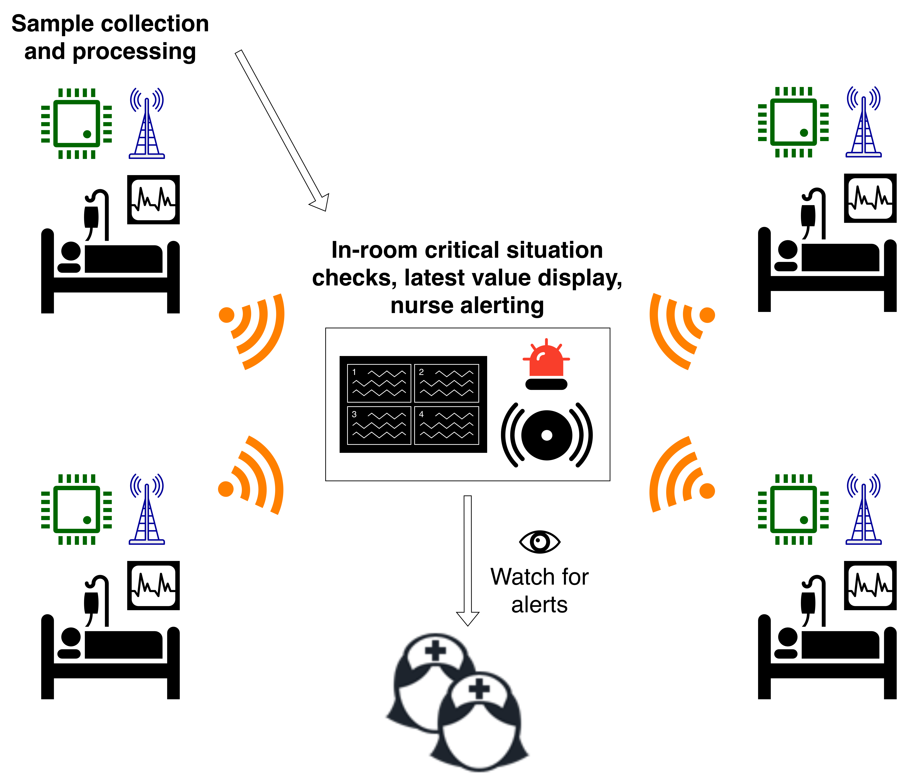

# Lifeguard &mdash; Concept

## The Problem

In the ever-evolving field of medical devices, comfort is often a second thought: hospital monitoring usually involves several wires running everywhere around a patient, restricting movement and making it easy to tear them or constrict body parts by accident. On top of that, even at-home medical monitoring devices a tradeoff usually needs to be made between an extremely high price tag or dangerously low-quality data.

## Our Idea

We chose to address these issues by focusing on developing a health monitoring system for hospital patients based on IoT, that could harness wireless, low-cost wearable devices to offer a more comfortable, more affordable alternative to existing solutions, without compromising on accuracy and real-time data updates.

The system consists of several monitoring straps, one per patient, collecting health data and reporting it back to a hub device found in each room, to run further processing and alert nurses if necessary.

The initial goals of this project are:
- Having a simple monitoring strap design that can eventually translate to an inexpensive and non-invasive wearable product;
- Collecting (at first) heart rate and SpO2 data with acceptable accuracy via wireless straps worn by each patient;
- Transmitting real-time data for all patients in the room to the close-by hub devices and alerting nurses with visual and audible cues promptly enough to allow effective intervention.

