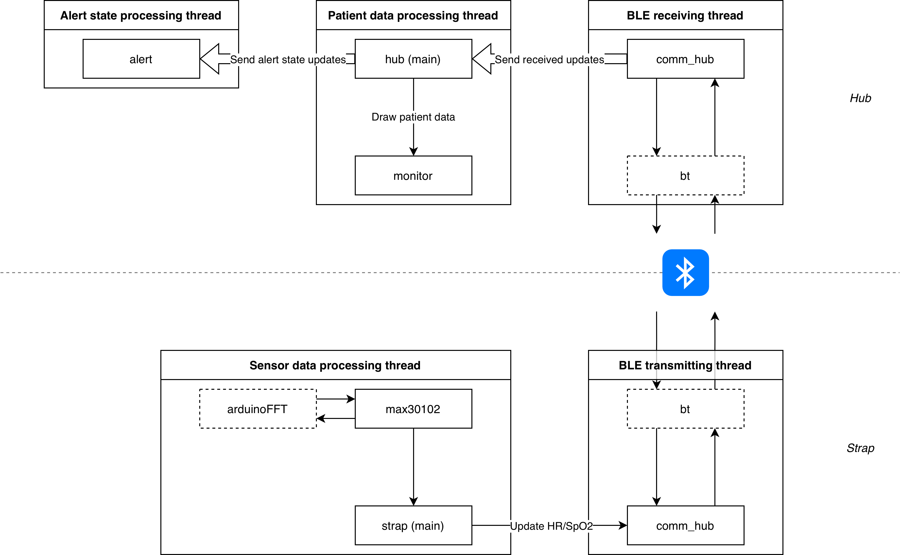
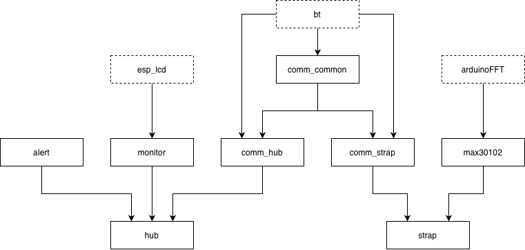

# Lifeguard &mdash; Design

## Constraints

As consequences of the goals stated in the original concept, the following technical constraints have been identified:
- **At least 1 week of strap battery life considering a standard 2500 mAh, 3.7 V LiPo rechargeable battery**
    - We don't want patients to have to recharge their monitoring straps too often, or the benefits of a wireless device would be diminished; most hospital patients don't stay for more than 7 days, making it an acceptable target
- **Being able to run on an embedded device running at 240 MHz at most**
    - We prototyped this project on an ESP32-S3, making its processing power a hard limit for the code; in general, as little processing power as possible should be used
- **Running all HR/SpO2 processing on-device**
    - It's unfeasible and inefficient for the monitoring strap to transmit all samples over the network for the room hub to run computation on them; a lower power consumption is achieved by using local processing instead

As well as one goal that isn't intrinsic to the concept but more of a sane expectation:
- **Always-guaranteed 5-second interval for the collection of initial or anomalous data, with a 30-second interval in consistently stable situations**
    - Taking measurements every 30 seconds or even less often is a standard upheld by wearable devices like the Apple Watch, saving power while still being frequent enough to allow prompt intervention
    - 5 seconds of minimum delay are necessary to process incoming sensor data accurately

## Data Flow

## Project Components and Dependency Graph

## Hardware Used

For the devices themselves:
- Two ESP32-S3 development boards (one Heltec LoRa 32 v3 and one Heltec LoRa 32 v4)
- One MAX30102 sensor
- An RGB led
- An active buzzer

Additional equipment not part of the design:
- An INA219 sensor, used for current monitoring
- An ATmega2560 development board for INA219 readings
- Two 4.7 k&Omega; resistors (used as I2C pull-ups for the ATmega2560 board)

## Monitoring Strap Behavior

As the monitoring strap becomes active, it starts a sensor data capturing and processing task and a BLE one.

The sensor data capturing task sets the MAX30102 sensor up to capture both IR and red light data and configures it to collect 25 samples/s (100 samples/s with 4-sample averaging); it then accumulates data for 128 samples, or around 5.12 s, and processes it using an FFT-based algorithm (using the `arduinoFFT` library).

As a history is absent at first, this sampling process runs constantly; once a history has been built, an algorithm is run after every new HR/SpO2 acquisition to adaptively decide whether inconclusive data or new/concerning trends create the need to sample continuously, or the patient's vitals are stable and can be checked more rarely, every 30 seconds, to save power.

For every new HR/SpO2 data point, the processing task also requests the BLE task to send the new values to the connected hub, if present and subscribed to indications.

The BLE task doesn't conventionally receive data, but instead only acts as a wrapper for the NimBLE stack.

## Use of BLE and exposed services

The strap exposes heart rate and SpO2 data over BLE, as well as identifying information encoded both in its device information service and in its advertisement data.

The exposed GATT services are:
- Service `0x180D` (Heart Rate Service):
    - Characteristic `0x2A37` (Heart Rate Measurement): readable and subscribable to via indications
- Service `0x1822` (Pulse Oximeter Service):
    - Characteristic `0x2AF9` (Generic Level): SpO2 percentage, readable and subscribable to via indications
- Service `0x180A` (Device Information Service):
    - Characteristic `0x2C34` (Installed Location): Room number, readable
    - Characteristic `0x2A9A` (User Index): Bed number, readable

Instead of requiring polling, inefficient for both parties, the strap lets the hub register for indications for heart rate and SpO2 updates. Once this mechanism is set up, the strap actively pushes new data to the hub whenever available and waits for its acknowledgement.

## Room Hub Behavior

As the room hub is switched on, it starts three tasks for alert processing, patient data processing and BLE receiving.

The BLE task immediately starts scanning for nearby monitoring straps that advertise themselves as belonging to its same room, and when found, connects to them and subscribes to their heart rate and SpO2 BLE characteristics; when a HR/SpO2 update is received, it associates it with the correct patient in an in-memory map and uses a FreeRTOS queue to relay the updated patient data to its processing task; analogously to the strap's BLE task, it otherwise only acts as a container for the NimBLE stack.

The patient data processing task processes updates received from the BLE task and runs checks on them to associate the patients with "warning" and "critical" states, with preset thresholds based on medical guidelines. It also sets up and updates the builtin OLED screen, to use as a small monitor for up to 4 patients, and uses it to display for each patient their latest heart rate and SpO2 values, as well as the newly calculated warning state.

The warning states calculated during patient data pocessing flow into a "collective" warning state taking on their highest-criticality present value. Whenever this value changes, it's broadcast to the alert processing task for visual and audio cues.

The alert processing task controls an external active buzzer and RGB LED based on the current collective warning state sent to it by the patient data processing task; specifically:
- In case of an "ok/healthy" state, neither the buzzer nor the LED are turned on;
- In case of a "warning" state, only the LED is turned on and glows yellow;
- In case of a "critical" state, the LED glows red and the buzzer is activated.

## Energy Optimization

While the hub's power draw is mostly inconsequential, as it can usually be connected to wall power, the strap adopts several optimizations:
- FreeRTOS's automatic light sleep feature;
- ESP32-S3 frequency scaling between 10 MHz and 80 MHz, based on software necessities;
- Using the lowest viable energy states for both the MAX30102's LEDs and the BLE TX antenna;
- BLE modem sleep and appropriate connection parameters (connection interval, peripheral latency) to reduce unnecessary wakeups;
- Adaptive HR/SpO2 sampling based on patient needs, enabling the MAX30102 sensor's sleep mode when not in use.

## SDK and External Libraries Used

ESP-IDF was used as the SDK to gain lower-level access to hardware.

Significant external libraries present in this project are:
- `arduinoFFT` for its tested and optimized FFT implementation
- `bt` (from ESP-IDF) using NimBLE as a host for all BLE functionality
- `esp_lcd` (from ESP-IDF) for drawing pixels to the hub's OLED monitor
- Basic ESP-IDF drivers for I2C and GPIO (`esp_driver_i2c` and `esp_driver_gpio` respectively)
- (Maxim's reference implementation for HR/SpO2 calculations, now unused)
- (`lmic`, previously used for LoRaWAN functionality and currently unused)
