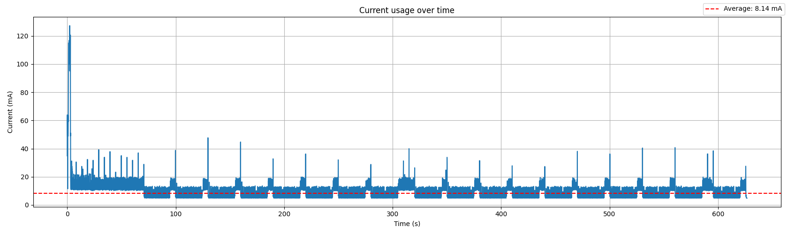
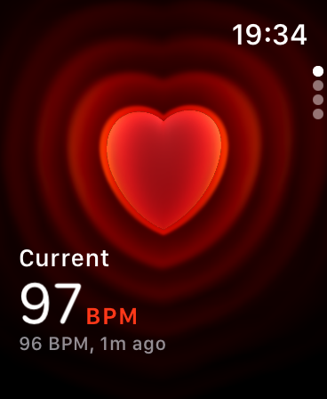
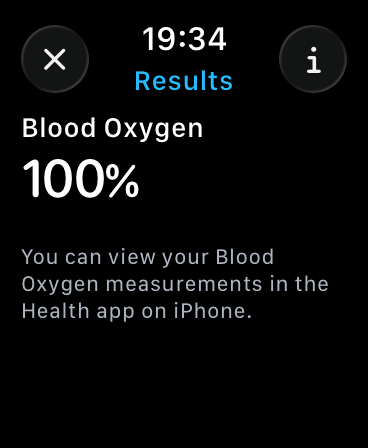
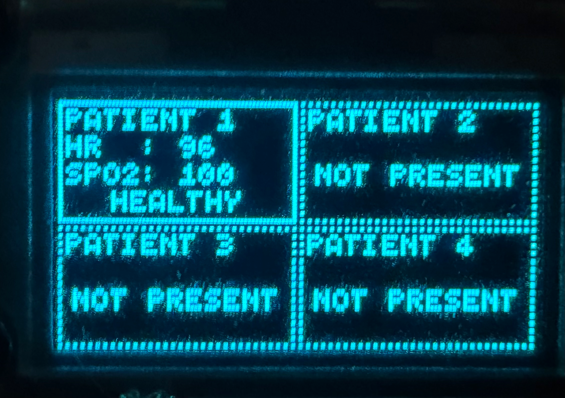

# Lifeguard &mdash; Evaluation

## Energy Usage

We evaluated the current draw of the strap in a typical situation by letting it run for 10 minutes while connected via BLE to a hub; few anomalies were present that required more raising the HR/SpO2 sampling frequency, but this was counterbalanced by the initial history construction. The combined current draw of the ESP32-S3 and MAX30102 from the power supply was analyzed using the INA219 + ATmega2560 setup, obtaining the following graph:

As can be seen, the average current draw over time is 8.14 mA, well below the original target of 15 mA.

## HR and SpO2 Accuracy vs a Commercial Product

The HR and SpO2 values reported by the finger-mounted monitoring strap to the hub were compared in real time to the ones reported by an Apple Watch Series 6:

 

In general, the deviation between the Apple Watch and strap was very low, at most &plusmn; 5 BPM and &plusmn;2% for HR and SpO2 respectively at a given time.

Specifically, the Apple Watch seemed to underestimate SpO2 compared to the strap (or possibly the opposite), and gave intermittently inconclusive results much more often while the strap's results remained stable. This might be because of the different placement and thus access to blood vessels.

Regarding heart rate, the strap actually seemed to extrapolate similar values but significantly anticipate them compared to the Apple Watch, which would seem to deviate in the moment but catch up after a few seconds. Accounting for this, the devices deviated from each other by very little.

## Latency and Duty Cycle

As visible in the current draw graph shown prior, while the sensor is sleeping and the processor isn't running any processing, the BLE TX antenna is activated very rarely, around once a second. As the INA219 samples the device's current draw every 68.1 ms and its level is at the sleeping baseline in both the previous and the next sample, it can be assumed that the TX antenna stays active for less than 68.1 ms every second, yielding a duty cycle of at most 6.81%.

In general, we can expect latency to be dependent on a few factors:
- HR/SpO2 sample collection: at most every 6.2 seconds, but usually every 5.2 seconds, after having detecting an anomaly, and every 30 seconds when stable;
- BLE connection interval and peripheral latency: as the connection interval can be between 50 and 100 ms, the latency before sending a new packet will be at most 100 ms.

Empirically, we measured the latency between HR/SpO2 samples being available (and thus processing starting) and them being displayed on the hub's monitor, at usual distances, as 118 ms for heart rate updates, and 1319 ms for SpO2 updates, usually broken down as follows:
- HR/SpO2 processing: 33.3 ms
- BLE latency: 72.1 ms
- Additional BLE latency for SpO2: 1201 ms
- Monitor redrawing: 12.6 ms

While the latency for HR updates can be explained by the connection delay, the additional latency for SpO2 ones can likely be explained by the 1 s peripheral latency: as the strap sends an indication for the heart rate, it expects an acknowledgement back, but by going to sleep for the next second, it adds an additional second of latency, plus eventual wakeup times, plus the transmission time for the SpO2 indication, resulting in the empirically measured value.

Taking the calculated SpO2 latency, we get a likely maximum latency from the patient to the hub's screen of around 7.5 seconds when an anomaly has been detected, and 31.3 seconds when the patient is stable.

## Goals and Constraints

Based on the initial goals:
> - Having a simple monitoring strap design that can eventually translate to an inexpensive and non-invasive wearable product;
> - Collecting (at first) heart rate and SpO2 data with acceptable accuracy via wireless straps worn by each patient;
> - Transmitting real-time data for all patients in the room to the close-by hub devices and alerting nurses with visual and audible cues promptly enough to allow effective intervention.

And constraints:
> - At least 1 week of strap battery life considering a standard 2500 mAh, 3.7 V LiPo rechargeable battery
> - Being able to run on an embedded device running at 240 MHz at most
> - Running all HR/SpO2 processing on-device

The project does meet the goals of achieving its purpose with a simple design (although still a prototype at this moment), collecting accurate HR and SpO2 data successfully and transmitting it to a hub via BLE, which processes them into alerts and monitor output.

As for the constraints, we achieved on-device HR/SpO2 processing first through Maxim's code, and later through our own FFT-based implementation, the CPU's clock frequency was not only respected but lowered to 80 MHz during processing, and battery life ended up being much better than the initial target.

Although we didn't meet the initial target we had set of 5 s maximum patient-to-hub-screen latency when in an anomalous state and 30 s otherwise, there is at least a clear path towards fulfilling it, while being able to empirically measure the currently exhibited latency to a very close value.
